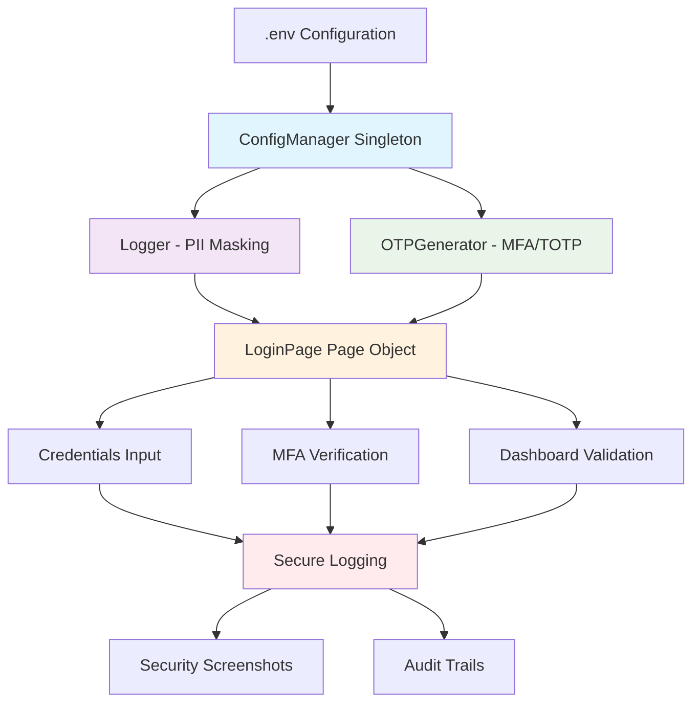

# Enterprise Fintech Automation Framework (Playwright + TypeScript)

> **Production-grade E2E testing framework built for highly regulated financial environments**

---

## 🔥 **Core Features**

**🔐 MFA/TOTP Support** - Built-in multi-factor authentication with automatic 6-digit code generation and verification

**🎭 PII Data Masking** - Automatic sensitive data redaction in logs, screenshots, and test reports

**⚙️ Singleton Config Management** - Centralized, secure configuration with mandatory secret validation

**🛡️ Security-First Design** - Comprehensive audit trails, error handling, and compliance features

---

## 🎯 **Why This Framework Exists**

This framework is specifically engineered for **highly regulated environments** (Banking/Insurance) where:

- **Security and audit trails are mandatory** - Every action is logged with timestamps and security context
- **PII protection is non-negotiable** - Sensitive data is automatically masked at every level
- **Compliance requirements are strict** - Built to meet financial industry standards (SOX, PCI-DSS, GDPR)
- **Enterprise integration is required** - Singleton patterns and centralized config for team collaboration
- **Reliability is critical** - Robust error handling, retry mechanisms, and fail-safe procedures

**Unlike generic testing frameworks**, this solution was designed from the ground up with financial services security requirements as the primary constraint, not an afterthought.

---

## 🚀 **Getting Started**

### **1. Environment Setup**
```bash
# Clone the repository
git clone <repository-url>
cd fintech-automation-framework

# Copy environment template
cp .env.example .env

# Fill in your actual credentials
nano .env  # Add your real fintech credentials
```

### **2. Install Dependencies**
```bash
# Install all dependencies including Playwright browsers
npm install
npx playwright install
```

### **3. Run Tests**
```bash
# Validate configuration
npx ts-node src/test-e2e-config.ts

# Run full authentication flow
npx playwright test tests/auth/full-auth-flow.test.ts

# Run all tests with HTML reports
npx playwright test --reporter=html
```

### **4. Verify Setup**
```bash
# Test OTP generation
npx ts-node src/test-otp.ts

# Test secure logging
npx ts-node src/test-logger.ts
```

---

## 🏗️ **Architecture Overview**



### **Component Flow Diagram**

```
┌─────────────────┐    ┌──────────────────┐    ┌─────────────────┐
│   .env File    │───▶│  ConfigManager  │───▶│     Logger      │
│                 │    │  (Singleton)    │    │  (PII Masking) │
│ • FINTECH_...   │    │                 │    │                 │
│ • MFA_SECRET    │    │ • getSecret()   │    │ • logAction()   │
│ • CLIENT_ID     │    │ • validate()     │    │ • maskData()    │
└─────────────────┘    └──────────────────┘    └─────────────────┘
         │                       │                       │
         │                       ▼                       │
         │              ┌──────────────────┐            │
         │              │  OTPGenerator   │            │
         │              │                 │            │
         │              │ • generateToken │            │
         │              │ • verifyToken   │            │
         │              │ • TOTP Support  │            │
         │              └──────────────────┘            │
         │                       │                       │
         └───────────────────────┼───────────────────────┘
                                 ▼
                    ┌──────────────────┐
                    │   LoginPage     │
                    │  (Page Object) │
                    │                 │
                    │ • navigateTo()  │
                    │ • loginWithCreds│
                    │ • handleMFA()   │
                    │ • failSafe()    │
                    └──────────────────┘
                                 │
                                 ▼
                    ┌──────────────────┐
                    │  E2E Tests     │
                    │                 │
                    │ • Auth Flow     │
                    │ • Security Tests │
                    │ • Compliance    │
                    └──────────────────┘
```

---

## 🛡️ **Security & Compliance Features**

### **Enterprise-Grade Security**
- ✅ **Zero PII in logs** - All sensitive data automatically redacted
- ✅ **Encrypted secret storage** - Environment-based configuration
- ✅ **Security screenshots** - Automatic capture on authentication failures
- ✅ **Audit trail logging** - Complete action history with timestamps
- ✅ **Fail-safe mechanisms** - Graceful error handling with security context

### **Regulatory Compliance**
- ✅ **SOX Compliance** - Comprehensive logging and audit capabilities
- ✅ **PCI-DSS Ready** - Secure handling of financial data
- ✅ **GDPR Compliant** - PII protection by design
- ✅ **Financial Industry Standards** - Built for banking/insurance requirements

---

## 📊 **Test Coverage & Reporting**

### **Comprehensive Test Suite**
- **Authentication Flow** - Complete login → MFA → Dashboard
- **Security Testing** - Invalid credentials, MFA failures, network issues
- **Compliance Validation** - Audit trail verification
- **Error Handling** - Fail-safe and recovery scenarios

### **Rich Reporting**
- **HTML Reports** - Interactive test results with screenshots
- **JSON/XML Export** - CI/CD integration ready
- **Security Logs** - Detailed audit trails
- **Video Evidence** - Screen recordings of test execution

---

## 🔧 **Technical Stack**

- **Playwright** - Modern, reliable browser automation
- **TypeScript** - Type-safe development with enterprise support
- **Node.js** - Cross-platform runtime environment
- **otplib** - Industry-standard TOTP implementation
- **dotenv** - Secure environment variable management

---

## 👥 **Team Collaboration**

### **Developer Experience**
- **IntelliSense Support** - Full TypeScript type definitions
- **Hot Reloading** - Fast development cycles
- **Debug Integration** - Step-through debugging capabilities
- **Git Hooks** - Pre-commit security validation

### **DevOps Integration**
- **CI/CD Ready** - GitHub Actions, GitLab CI support
- **Container Support** - Docker-friendly configuration
- **Environment Isolation** - Dev/Staging/Production configs
- **Automated Reporting** - Slack/Teams integration ready

---

## 📈 **Performance & Reliability**

### **Enterprise Features**
- **Parallel Execution** - Multi-browser testing simultaneously
- **Retry Mechanisms** - Robust failure recovery
- **Timeout Management** - Configurable wait strategies
- **Resource Optimization** - Memory and CPU efficient

### **Monitoring & Alerts**
- **Real-time Status** - Live test execution monitoring
- **Failure Notifications** - Immediate security incident alerts
- **Performance Metrics** - Execution time and resource usage
- **Health Checks** - Continuous system validation

---

## 🎓 **Learning & Documentation**

### **Comprehensive Guides**
- **Setup Instructions** - Step-by-step environment configuration
- **API Documentation** - Complete method and class references
- **Best Practices** - Security-first development guidelines
- **Troubleshooting** - Common issues and solutions

### **Code Examples**
- **Authentication Patterns** - Login, MFA, session management
- **Security Implementations** - PII masking, audit logging
- **Test Scenarios** - Real-world financial testing cases
- **Integration Samples** - Third-party system connections

---

## 🚀 **Production Deployment**

### **Enterprise Ready**
- **Scalable Architecture** - Handles large test suites efficiently
- **Secure Configuration** - Production-grade secret management
- **Monitoring Integration** - Splunk, DataDog, New Relic ready
- **Compliance Reporting** - Automated audit report generation

### **Support & Maintenance**
- **Regular Updates** - Security patches and feature enhancements
- **Community Support** - Active development and issue resolution
- **Enterprise Support** - Priority support for production deployments
- **Training Resources** - Team onboarding and best practices

---

## 📞 **Contact & Support**

- **Repository**: [GitHub Link]
- **Documentation**: [Docs Site]
- **Issues**: [GitHub Issues]
- **Discussions**: [GitHub Discussions]
- **Enterprise Support**: [Contact Email]

---

> **Built for the future of financial services testing**  
> *Security, Compliance, and Reliability by Design*
